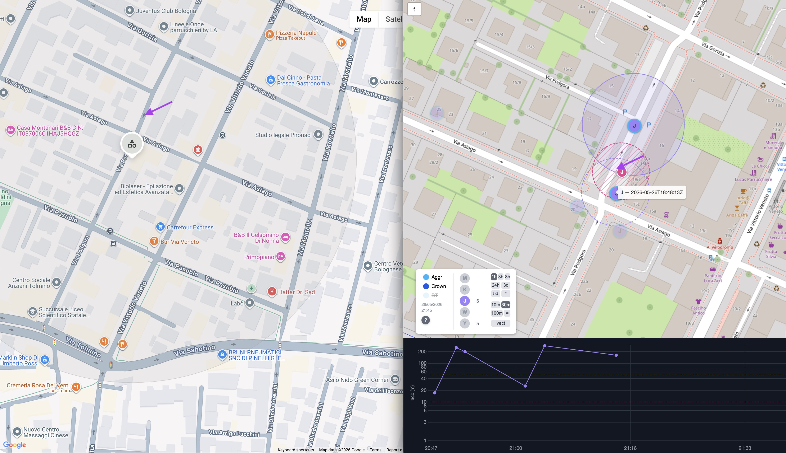

# tagPosition

Web map for tracking Google Find Hub Bluetooth tags (Android). Polls tag positions via the unofficial Google Find Hub API, stores them as NDJSON, and renders an interactive map with live updates.

No official Google API is used. The network layer is provided by [GoogleFindMyTools](https://github.com/leonboe1/GoogleFindMyTools) (Leon Böttger, SEEMOO / TU Darmstadt).

**Why this project exists:** the Google Find Hub app has three limitations that make it impractical for serious tracking: it shows only the current position with no history or trail; it displays only one tag at a time with no multi-tag map view; and its position estimate is often inaccurate by tens to hundreds of metres, with no way to aggregate multiple readings to narrow it down. tagPosition addresses all three: it records every fix over time, shows all tags simultaneously on a single map, and computes a weighted centroid from multiple readings for a much more precise position estimate.



*The arrow marks the exact location of tag J. The raw fixes reported by Google are scattered over a wide area — individually they are too imprecise to be useful. The weighted centroid computed from those same fixes (pink dashed circle) pinpoints the actual position with much higher accuracy.*

---

## How it works

```
auth.py      →  one-time OAuth flow, saves credentials to lib/GoogleFindMyTools/Auth/secrets.json
poller.py    →  queries tag positions via FCM + Nova API, appends NDJSON to data/positions.json
server.py    →  HTTP server: serves the map page + SSE live-update stream
map.py       →  generates the map HTML (used by server.py and standalone)
show.py      →  CLI summary / dump of the position archive
update.sh    →  cron wrapper: runs poller.py, weekly --purge
sendToPi.sh  →  helper: scp files to a Raspberry Pi deploy
```

Data flow: `poller.py` writes to `data/positions.json` (NDJSON, one entry per fix). `server.py` serves the map on demand and pushes SSE events when the file changes. The browser receives live updates without reloading.

---

## Prerequisites

- Python 3.11+
- Google Chrome (for the one-time OAuth flow in `auth.py`)
- An Android device registered on Google Find Hub with at least one tracker

---

## Installation

```bash
git clone --recurse-submodules https://github.com/ghedolo/tagPosition.git
cd tagPosition
python3 -m venv .venv
source .venv/bin/activate
pip install -r lib/GoogleFindMyTools/requirements.txt
```

---

## Usage

### 1 — Authenticate (one-time)

```bash
source .venv/bin/activate && python auth.py
```

Chrome opens twice: once for the OAuth flow, once for the E2EE shared key. Credentials are saved to `lib/GoogleFindMyTools/Auth/secrets.json` (excluded from git).

### 2 — Poll tag positions

```bash
source .venv/bin/activate && python poller.py
```

Fetches all trackers on your account, decrypts locations, appends new fixes to `data/positions.json`.

### 3 — Start the map server

```bash
source .venv/bin/activate && python server.py
```

Open `http://127.0.0.1:8765` in a browser. The map updates automatically when `poller.py` writes new data.

### Generate a static map (no server)

```bash
source .venv/bin/activate && python map.py
open tmp/map.html
```

### Inspect the archive

```bash
source .venv/bin/activate && python show.py
source .venv/bin/activate && python show.py --tag "My Tag" --from 2026-05-01
source .venv/bin/activate && python show.py --all
```

### Purge old data (archive entries older than 7 days)

```bash
source .venv/bin/activate && python poller.py --purge
```

---

## Automated polling (cron)

Example cron entry that polls every 15 minutes and purges on Monday at midnight:

```
*/15 * * * * cd /home/pi/tagPosition && bash update.sh >> tmp/update.log 2>&1
```

---

## Deploy on Raspberry Pi

1. Edit `sendToPi.sh` — replace `<YOUR_PI_IP>` with your Pi's IP address.
2. Transfer files:
   ```bash
   bash sendToPi.sh
   ```
3. On the Pi: recreate the venv, install dependencies (same steps as Installation), create the runtime directories, run `auth.py` once (requires Chrome), then start the server.
   ```bash
   mkdir -p data tmp
   ```
4. Create a systemd service for `server.py` and proxy through nginx (see below).

### systemd service

`/etc/systemd/system/tagmap.service`:

```ini
[Unit]
Description=Tag Map Server
After=network.target

[Service]
Type=simple
User=pi
WorkingDirectory=/home/pi/tagPosition
ExecStart=/home/pi/tagPosition/.venv/bin/python server.py --host 127.0.0.1 --port 8765
Restart=on-failure

[Install]
WantedBy=multi-user.target
```

```bash
sudo systemctl enable --now tagmap
```

After deploying updated Python files, restart with `sudo systemctl restart tagmap`.

### nginx reverse proxy

Install nginx and create an htpasswd file for basic auth:

```bash
sudo apt install nginx apache2-utils
sudo htpasswd -c /etc/nginx/htpasswd <username>
```

`/etc/nginx/sites-enabled/tagmap`:

```nginx
server {
    listen 7880;
    auth_basic "Map";
    auth_basic_user_file /etc/nginx/htpasswd;

    location / {
        proxy_pass http://127.0.0.1:8765;
        proxy_http_version 1.1;
        proxy_set_header Host $host;
        proxy_set_header Connection '';
        proxy_buffering off;
        proxy_cache off;
        proxy_read_timeout 3600;
    }
}
```

`proxy_buffering off` and `proxy_read_timeout 3600` are required for the SSE stream (`/events`) to work correctly through the proxy.

---

## Map interface

The map is built with [Leaflet](https://leafletjs.com/) and [leaflet-rotate](https://github.com/Raruto/leaflet-rotate). The accuracy chart uses [Chart.js](https://www.chartjs.org/).

### Legend panel (bottom-left)

**Status column**

| Badge | Meaning |
|---|---|
| **Aggr** | AGGREGATED — position computed by combining multiple recent crowd signals |
| **Crown** | CROWDSOURCED — position estimated from nearby Android devices that detected the tracker |
| **BT** | LAST_KNOWN — last position reported directly by the tracker itself |

Click a badge to show/hide markers with that status. Default: only Aggr enabled.

The timestamp below the badges shows the most recent `polled_at` time.

The **?** button opens the help panel.

**Tags column**

One colored circle per tracker, labelled with the first letter of the tag name. If two tags share the same initial, the first two letters are used instead. Click to show/hide that tag on the map. The counter next to each circle shows the number of visible points in the current time window.

**Controls column**

| Control | Action |
|---|---|
| `1h` `3h` `8h` `24h` `3d` `5d` `*` | Time window filter. Windows ≥ 3d load older data on demand (one fetch). |
| `10m` `30m` `100m` `∞` | Accuracy threshold for centroid computation. Points with accuracy above threshold are dimmed and excluded from the centroid. Default: ∞ (no filter). |
| `vect` | Toggle path lines connecting consecutive fixes. |

### Markers

- **Click** — opens a popup: tag name, status, own/crowd report flag, location time, polled time, accuracy, altitude.
- **Hover** — shows a dashed accuracy circle (radius = `accuracy_m`). Not shown on dimmed markers.
- **Double-click** — pins/unpins a solid accuracy circle.
- **White letter** — most recent fix for that tag. Grey letter = older fix.

### Centroid (pink dashed circle)

Drawn automatically when a tag is visible with enough points in the selected window:

| Window | Min points | Max outliers excluded |
|---|---|---|
| 1h / 3h / 8h | 2 | 2 |
| 24h | 6 | 3 |

Weighted centroid (w = 1/acc²). Points more than 500 m from the centroid are treated as outliers. Double-click the pink marker to see point count and combined precision (±X m).

### Accuracy chart

Log-scale scatter plot at the bottom of the page. X axis: time (matches the selected window). Y axis: `accuracy_m`. One series per visible tag. Dashed reference lines at 10 m and 50 m. Hidden on mobile / landscape phone.

### Map controls

- **Compass** (top-right) — drag to rotate the map. Two-finger rotate on touch.
- **Scale ruler** (bottom-right) — metric, updates with zoom.
- **Zoom** — scroll wheel or pinch.

---

## Configuration

`map.py` exposes two constants at the top of the file:

| Constant | Default | Description |
|---|---|---|
| `TAG_RENAME` | `{"Google Pixel 9": "My Phone"}` | Rename a tag for display only. Raw name in archive is preserved. |
| `TAG_COLORS` | yellow, green, violet, pink, orange | Cycle of fill colors assigned to tags in order. |

---

## License

GPL-3.0. See [LICENSE](LICENSE).

This project uses [GoogleFindMyTools](https://github.com/leonboe1/GoogleFindMyTools) by **Leon Böttger** (SEEMOO, TU Darmstadt), also licensed under GPL-3.0. If you use or redistribute this project, please cite the original library as indicated in its [CITATION.cff](lib/GoogleFindMyTools/CITATION.cff).

---

## Author

ghedo (luca.ghedini@gmail.com) — 2026

Built with [Claude Code](https://claude.ai/claude-code) by Anthropic.

---

## Development effort

This project was built entirely through a conversation with Claude Code. The numbers below are extracted from the local session transcripts (`~/.claude/projects/.../tagPosition/*.jsonl`) and from the git history.

- **First message:** 2026-05-14
- **Last message:** 2026-05-26
- **Calendar span:** ~12 days, 6 sessions, 2897 messages (1158 user + 1739 assistant)
- **Active conversation time: ~899 minutes (~15.0 hours)**

*How active time is computed:* timestamps are sorted across all sessions; consecutive gaps ≤ 5 minutes are summed. Longer gaps (overnight, idle time) are discarded.

### Tokens

Cumulative token counts across all 6 sessions:

| Metric | Tokens |
|---|---:|
| Input (non-cache) | 16,211 |
| Output | 1,629,599 |
| Cache write | 3,319,914 |
| Cache read | 153,915,422 |
| **Total** | **~159 M** |

Cache-read tokens dominate because every turn re-reads the existing context from the prompt cache. The actual model output is ~1.6 M tokens; new context accumulated into the cache is ~3.3 M tokens.

### Caveman mode

4 of the 6 sessions were run with [caveman mode](https://github.com/ghedolo/vfd-clock) active — a Claude Code skill that drops filler words, articles, and pleasantries from assistant responses while keeping full technical content. The effect on token counts is measurable: in caveman sessions the assistant produced an average of **230 output tokens per message**, versus **409 tokens per message** in standard sessions — a **~44% reduction in output verbosity**. Cache-read tokens per message also dropped, because shorter assistant turns accumulate less context into subsequent turns. Total output tokens: ~497 K with caveman, ~1.13 M without.
