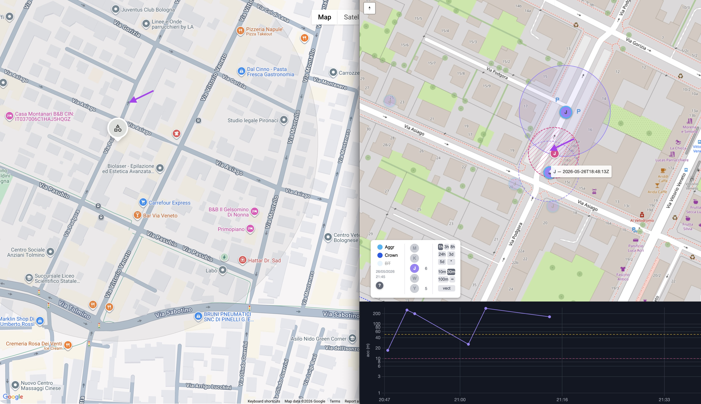

# tagPosition

Web map for tracking Google Find Hub Bluetooth tags (Android). Polls tag positions via the unofficial Google Find Hub API, stores them as NDJSON, and renders an interactive map with live updates.

No official Google API is used. The network layer is provided by [GoogleFindMyTools](https://github.com/leonboe1/GoogleFindMyTools) (Leon Böttger, SEEMOO / TU Darmstadt).

**Why this project exists:** the Google Find Hub app has three limitations that make it impractical for serious tracking: it shows only the current position with no history or trail; it displays only one tag at a time with no multi-tag map view; and its position estimate is often inaccurate by tens to hundreds of metres, with no way to aggregate multiple readings to narrow it down. tagPosition addresses all three: it records every fix over time, shows all tags simultaneously on a single map, and computes a weighted centroid from multiple readings for a much more precise position estimate.



*The arrow marks the exact location of tag J. The raw fixes reported by Google are scattered over a wide area — individually they are too imprecise to be useful. The weighted centroid computed from those same fixes (pink dashed circle) pinpoints the actual position with much higher accuracy.*

---

## How it works

```
auth.py      →  one-time OAuth flow, saves credentials to lib/GoogleFindMyTools/Auth/secrets.json
poller.py    →  queries tag positions via FCM + Nova API, appends NDJSON to data/positions.json
server.py    →  HTTP server: serves the map page + SSE live-update stream
map.py       →  generates the map HTML (used by server.py and standalone)
show.py      →  CLI summary / dump of the position archive
update.sh    →  cron wrapper: runs poller.py, weekly --purge
sendToPi.sh  →  helper: scp files to a Raspberry Pi deploy
harden_pi.sh →  applies the permission / systemd / nginx hardening on the Pi
```

Data flow: `poller.py` writes to `data/positions.json` (NDJSON, one entry per fix) and its own run log to `tmp/poller.log`, rotated at 5 MB with 5 backups. `server.py` serves the map on demand and pushes SSE events when the file changes. The browser receives live updates without reloading.

---

## Prerequisites

- Python 3.11+
- Google Chrome (for the one-time OAuth flow in `auth.py`)
- An Android device registered on Google Find Hub with at least one tracker

---

## Installation

```bash
git clone --recurse-submodules https://github.com/ghedolo/tagPosition.git
cd tagPosition
python3 -m venv .venv
source .venv/bin/activate
pip install -r lib/GoogleFindMyTools/requirements.txt
python patches/fcm_patch.py
python patches/perms_patch.py
```

`requirements.txt` of the submodule pins only minimum versions. `requirements.lock`
holds the exact versions of a working environment; use it to reproduce that
environment instead: `pip install -r requirements.lock`.

The two patch scripts fix the vendored submodule and must be re-run after every
`git submodule update`:

| Patch | Fixes |
|---|---|
| `patches/fcm_patch.py` | FCM push decryption with unpadded / prefix-less `crypto-key` and `encryption` headers |
| `patches/perms_patch.py` | `secrets.json` written world-readable (644); after the patch it is created with mode 600 |

---

## Usage

### 1 — Authenticate (one-time)

```bash
source .venv/bin/activate && python auth.py
```

Chrome opens twice: once for the OAuth flow, once for the E2EE shared key. Credentials are saved to `lib/GoogleFindMyTools/Auth/secrets.json` (excluded from git).

### 2 — Poll tag positions

```bash
source .venv/bin/activate && python poller.py
```

Fetches all trackers on your account, decrypts locations, appends new fixes to `data/positions.json`.

### 3 — Start the map server

```bash
source .venv/bin/activate && python server.py
```

Two tests, depending on where the server runs:

- **Local machine** — open `http://127.0.0.1:8765` in a browser.
- **Raspberry Pi** — open `http://<PI_IP>:7880` from another machine on the LAN (nginx reverse proxy with basic auth, see [nginx reverse proxy](#nginx-reverse-proxy)). `http://<PI_IP>:8765` does **not** answer from outside: `server.py` binds `127.0.0.1` only. To check port 8765 directly, do it from the Pi itself: `curl -sI http://127.0.0.1:8765`.

The map updates automatically when `poller.py` writes new data.

### Generate a static map (no server)

```bash
source .venv/bin/activate && python map.py
open tmp/map.html
```

### Inspect the archive

```bash
source .venv/bin/activate && python show.py
source .venv/bin/activate && python show.py --tag "My Tag" --from 2026-05-01
source .venv/bin/activate && python show.py --all
```

### Purge old data (archive entries older than 7 days)

```bash
source .venv/bin/activate && python poller.py --purge
```

---

## Automated polling (cron)

Example cron entry that polls every 15 minutes and purges on Monday at midnight:

```
*/15 * * * * bash -c 'cd /home/pi/tagPosition && bash update.sh >> tmp/cron.log 2>&1'
```

`poller.py` writes its own log to `tmp/poller.log` through a `RotatingFileHandler`:
when the file passes 5 MB it becomes `poller.log.1`, older backups shift up to
`poller.log.5` and the oldest is dropped, so the log is capped at about 30 MB.
Change the limits with `LOG_MAX_BYTES` and `LOG_BACKUP_COUNT` in `poller.py`, or
point the log elsewhere with `--log-file`.

**Do not redirect cron to `tmp/poller.log`.** The poller opens that file itself,
so a redirect onto the same path writes every line twice and breaks the rotation:
on rotation the handler renames `poller.log` to `poller.log.1` and opens a new
`poller.log`, while the descriptor cron opened stays attached to the renamed
inode. `poller.log.1` would then keep growing past the size limit and never be
rotated again.

The redirect target above, `tmp/cron.log`, only collects failures that happen
before Python starts (missing venv, shell syntax error), so it stays small.
Replace it with `/dev/null` if those are not worth keeping.

---

## Deploy on Raspberry Pi

1. Edit `sendToPi.sh` — replace `<YOUR_PI_IP>` with your Pi's IP address.
2. Transfer files:
   ```bash
   bash sendToPi.sh
   ```
3. On the Pi: recreate the venv, install dependencies (same steps as Installation), create the runtime directories, run `auth.py` once (requires Chrome), then start the server.
   ```bash
   mkdir -p data tmp
   ```
4. Create a systemd service for `server.py` and proxy through nginx (see below).
5. Run the hardening script — it re-applies the submodule patches, restricts the
   permissions of `secrets.json`, `data/` and `tmp/`, makes systemd start the server
   with `umask 0077`, and adds a per-IP connection limit to nginx:
   ```bash
   bash harden_pi.sh --dry-run   # show what would change
   bash harden_pi.sh
   ```
   It is idempotent, needs `sudo` for the systemd and nginx steps, and rolls the
   systemd drop-in back automatically if the service fails to restart.

### systemd service

`/etc/systemd/system/tagmap.service`:

```ini
[Unit]
Description=Tag Map Server
After=network.target

[Service]
Type=simple
User=pi
WorkingDirectory=/home/pi/tagPosition
ExecStart=/home/pi/tagPosition/.venv/bin/python server.py --host 127.0.0.1 --port 8765
Restart=on-failure

[Install]
WantedBy=multi-user.target
```

```bash
sudo systemctl enable --now tagmap
```

After deploying updated Python files, restart with `sudo systemctl restart tagmap`.

### nginx reverse proxy

Install nginx and create an htpasswd file for basic auth:

```bash
sudo apt install nginx apache2-utils
sudo htpasswd -c /etc/nginx/htpasswd <username>
```

`/etc/nginx/sites-enabled/tagmap`:

```nginx
server {
    listen 7880;
    auth_basic "Map";
    auth_basic_user_file /etc/nginx/htpasswd;

    location / {
        proxy_pass http://127.0.0.1:8765;
        proxy_http_version 1.1;
        proxy_set_header Host $host;
        proxy_set_header Connection '';
        proxy_buffering off;
        proxy_cache off;
        proxy_read_timeout 3600;
    }
}
```

`proxy_buffering off` and `proxy_read_timeout 3600` are required for the SSE stream (`/events`) to work correctly through the proxy.

### Boot checks

After a fresh install — and after any change to the service, cron or nginx — verify that everything comes back up on its own. Run on the Pi:

**1. Server service**

```bash
systemctl is-enabled tagmap    # must print: enabled  (disabled = will NOT start at boot)
systemctl is-active tagmap     # must print: active
systemctl status tagmap -n 20  # check ExecStart path and recent log lines
```

If it prints `disabled`, enable it: `sudo systemctl enable tagmap`.

**2. Polling cron**

```bash
crontab -l                     # the update.sh line must be there
systemctl is-enabled cron      # must print: enabled
tail -20 /home/pi/tagPosition/tmp/poller.log
```

The log confirms the job actually runs; an empty or stale log means cron is not firing, or `update.sh` is failing before writing.

**3. nginx**

```bash
systemctl is-enabled nginx
systemctl is-active nginx
```

**4. Runtime prerequisites**

```bash
ls -ld /home/pi/tagPosition/data /home/pi/tagPosition/tmp   # must exist, owned by pi
ls /home/pi/tagPosition/.venv/bin/python                    # venv must be present
grep -i -m5 'error\|auth' /home/pi/tagPosition/tmp/poller.log
```

An expired Google token does not stop the service — the map stays up but no new fixes arrive, so check the poller log as well.

**5. Real reboot test**

```bash
sudo reboot
# wait ~60 s, then from another machine:
ssh pi@<PI_IP> 'systemctl is-active tagmap nginx cron'
```

Then open `http://<PI_IP>:7880` and confirm the map loads with current data.

---

## Map interface

The map is built with [Leaflet](https://leafletjs.com/) and [leaflet-rotate](https://github.com/Raruto/leaflet-rotate). The accuracy chart uses [Chart.js](https://www.chartjs.org/).

### Legend panel (bottom-left)

**Status column**

| Badge | Meaning |
|---|---|
| **Aggr** | AGGREGATED — position computed by combining multiple recent crowd signals |
| **Crown** | CROWDSOURCED — position estimated from nearby Android devices that detected the tracker |
| **BT** | LAST_KNOWN — last position reported directly by the tracker itself |

Click a badge to show/hide markers with that status. Default: only Aggr enabled.

The timestamp below the badges shows the most recent `polled_at` time.

The **?** button opens the help panel.

**Tags column**

One colored circle per tracker, labelled with the first letter of the tag name. If two tags share the same initial, the first two letters are used instead. Click to show/hide that tag on the map. The counter next to each circle shows the number of visible points in the current time window.

**Controls column**

| Control | Action |
|---|---|
| `1h` `3h` `8h` `24h` `3d` `5d` `*` | Time window filter. Windows ≥ 3d load older data on demand (one fetch). |
| `10m` `30m` `100m` `∞` | Accuracy threshold for centroid computation. Points with accuracy above threshold are dimmed and excluded from the centroid. Default: ∞ (no filter). |
| `vect` | Toggle path lines connecting consecutive fixes. |
| `Δ` | Toggle the accuracy circle of every visible marker at once. Circles follow the time/status/tag filters; points above the accuracy threshold get a dashed unfilled circle. |

### Markers

- **Click** — opens a popup: tag name, status, own/crowd report flag, location time, polled time, accuracy, altitude.
- **Hover** — shows a dashed accuracy circle (radius = `accuracy_m`). Not shown on dimmed markers.
- **Double-click** — pins/unpins a solid accuracy circle. The `Δ` button does the same for all visible markers at once.
- **White letter** — most recent fix for that tag. Grey letter = older fix. The most
  recent fix is computed on the whole dataset **before** the filters are applied, so if
  it is excluded by the status or time filter no marker of that tag shows a white
  letter. This happens routinely when the newest fix is `LAST_KNOWN` (off by default in
  the legend) while the visible ones are `AGGREGATED`.

### Centroid (pink dashed circle)

Drawn automatically when a tag is visible with enough points in the selected window:

| Window | Min points | Max outliers excluded |
|---|---|---|
| 1h / 3h / 8h | 2 | 2 |
| 24h | 6 | 3 |

Weighted centroid (w = 1/acc²). Points more than 500 m from the centroid are treated as outliers. Double-click the pink marker to see point count and combined precision (±X m).

### Accuracy chart

Log-scale scatter plot at the bottom of the page. X axis: time (matches the selected window). Y axis: `accuracy_m`. One series per visible tag. Dashed reference lines at 10 m and 50 m. Hidden on mobile / landscape phone.

### Map controls

- **Compass** (top-right) — drag to rotate the map. Two-finger rotate on touch.
- **Scale ruler** (bottom-right) — metric, updates with zoom.
- **Zoom** — scroll wheel or pinch.

---

## Configuration

`map.py` exposes two constants at the top of the file:

| Constant | Default | Description |
|---|---|---|
| `TAG_RENAME` | `{"Google Pixel 9": "My Phone"}` | Rename a tag for display only. Raw name in archive is preserved. |
| `TAG_COLORS` | yellow, green, violet, pink, orange | Cycle of fill colors assigned to tags in order. |

---

## Security

The position archive is personal data and `secrets.json` grants full access to the
Google Find Hub account, so the project is built for a single trusted user on a
trusted network. The measures below come from a code review of the whole project
carried out on 2026-08-23. What is enforced in the code:

| Area | Measure |
|---|---|
| Credentials | `secrets.json` created with mode 600 (`patches/perms_patch.py`) |
| Position data | `data/`, `tmp/` created with mode 700, files with 600 (`poller.py`, `map.py`) |
| Tag names | HTML-escaped in the legend and slash-escaped inside the `<script>` block, so a tracker shared by another account cannot inject markup or JavaScript |
| Third-party assets | Leaflet, leaflet-rotate and Chart.js loaded with Subresource Integrity hashes |
| Live stream | `/events` capped at `MAX_SSE_CLIENTS` concurrent connections (8); each one holds a thread for its lifetime |
| Generated files | `tmp/data_extended.json` written to a temporary file and renamed, so a concurrent request never reads a half-written file |
| Server binding | `server.py` defaults to `127.0.0.1` and has no authentication of its own: never bind it to `0.0.0.0` without the nginx front end |

What is **not** solved and stays the operator's decision:

- **Transport encryption.** The nginx reverse proxy in this README listens in clear
  HTTP: basic auth credentials and position data travel unencrypted. Acceptable on a
  trusted LAN only. For remote access use a VPN/Tailscale, or add TLS — `harden_pi.sh`
  prints the three options at the end of its run.
- **Retention.** `poller.py --purge` does not delete anything: it moves entries older
  than `PURGE_DAYS` into `data/position_<from>_<to>.json`, which stays on disk
  indefinitely. Delete the rotated files yourself if you do not want a permanent
  location history.

---

## Tests

The suite covers the local logic only: no Google API call is ever made, and no file
outside a temporary directory is written.

```bash
source .venv/bin/activate
pip install -r requirements-dev.txt
python -m pytest
```

| File | Covers |
|---|---|
| `tests/test_map_logic.py` | `assign_letters`, `load_entries`, `split_entries` — grouping, sorting, tag rename, malformed NDJSON |
| `tests/test_map_render.py` | `render_html` — page structure, map centring, embedded JSON payloads, live/static variants, tag-name injection |
| `tests/test_poller_archive.py` | `_purge`, `_load_archive_state`, `_data_lock`, `_ts_to_fname`, `_status_name` |
| `tests/test_poller_logging.py` | the rotating log: size cap, backup count, owner-only permissions, INFO to stdout and WARNING to stderr |
| `tests/test_poller_dedup.py` | `poller.main()` with the network layer stubbed: which fixes get appended and which are discarded |
| `tests/test_show.py` | `show.py` filters (tag, date range) and summary output |
| `tests/test_server.py` | a real HTTP server on an ephemeral port: routing, 404, 503, `data_extended.json`, SSE ping and update |
| `tests/test_scripts_and_hygiene.py` | `update.sh` cron logic with a stubbed `date`, shell syntax, git-ignore rules for credentials and position data |
| `tests/test_security_regressions.py` | the findings of the security review: file permissions, HTML escaping, SRI, loopback binding |

All tests are green. `tests/test_security_regressions.py` pins the fixes of the
security review, so a regression on file permissions, HTML escaping or SRI fails the
suite. A test marked `xfail` would describe a known open issue; with `strict=True`
it turns into a failure as soon as the issue is fixed, which is the signal to remove
the marker.

---

## License

GPL-3.0. See [LICENSE](LICENSE).

This project uses [GoogleFindMyTools](https://github.com/leonboe1/GoogleFindMyTools) by **Leon Böttger** (SEEMOO, TU Darmstadt), also licensed under GPL-3.0. If you use or redistribute this project, please cite the original library as indicated in its [CITATION.cff](lib/GoogleFindMyTools/CITATION.cff).

---

## Author

ghedo (luca.ghedini@gmail.com) — 2026

Built with [Claude Code](https://claude.ai/claude-code) by Anthropic.

---

## Development effort

This project was built entirely through a conversation with Claude Code. The numbers below are extracted from the local session transcripts (`~/.claude/projects/.../tagPosition/*.jsonl`) and from the git history.

- **First message:** 2026-05-14
- **Last message:** 2026-08-23
- **Sessions:** 9 sessions, 3343 messages (1324 user + 2019 assistant)
- **Calendar span:** ~12 days of work in May 2026 plus two maintenance days on 2026-08-23 (feature refresh, then security review and test suite)
- **Active conversation time: ~995 minutes (~16.6 hours)**

*How active time is computed:* timestamps are sorted across all sessions; consecutive gaps ≤ 5 minutes are summed. Longer gaps (overnight, idle time) are discarded.

### Tokens

Cumulative token counts across all 9 sessions:

| Metric | Tokens |
|---|---:|
| Input (non-cache) | 16,771 |
| Output | 1,818,802 |
| Cache write | 3,697,520 |
| Cache read | 173,314,708 |
| **Total** | **~179 M** |

Cache-read tokens dominate because every turn re-reads the existing context from the prompt cache. The actual model output is ~1.8 M tokens; new context accumulated into the cache is ~3.7 M tokens.

### Caveman mode

7 of the 9 sessions were run with [caveman mode](https://github.com/ghedolo/vfd-clock) active — a Claude Code skill that drops filler words, articles, and pleasantries from assistant responses while keeping full technical content. The effect on token counts is measurable: in caveman sessions the assistant produced an average of **230 output tokens per message**, versus **409 tokens per message** in standard sessions — a **~44% reduction in output verbosity**. Cache-read tokens per message also dropped, because shorter assistant turns accumulate less context into subsequent turns. Total output tokens: ~687 K with caveman, ~1.13 M without. The per-message averages above are measured on the first 6 sessions, the only ones whose transcripts were still on disk in full when the averages were computed.

The ninth session (security review and test suite) is an outlier at **842 output tokens per message**: almost all of its output is file content written through tools — test modules, patch scripts, `harden_pi.sh` — not prose, and caveman mode compresses prose only.
